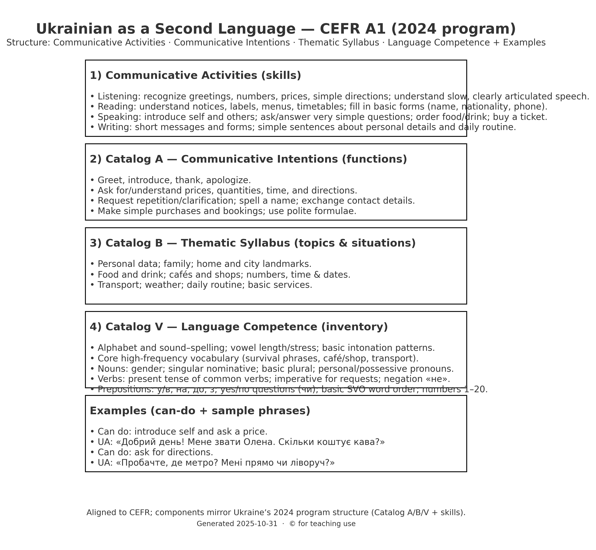
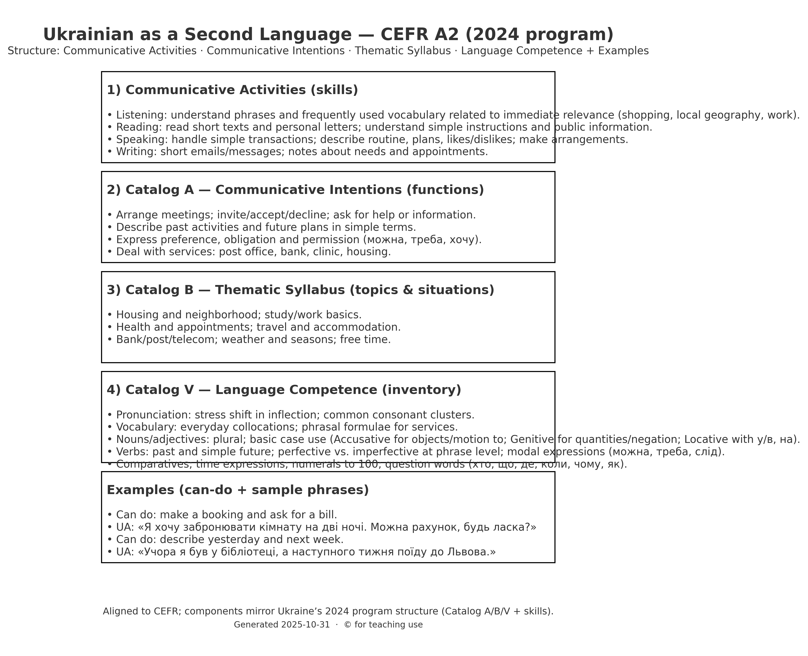
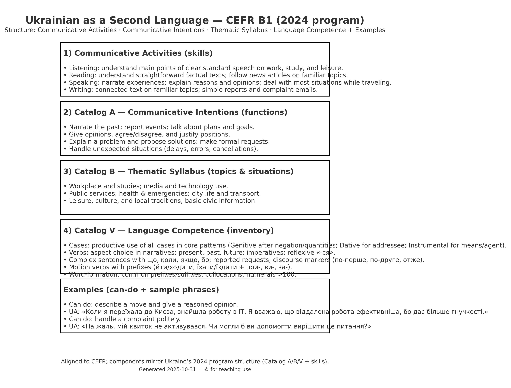
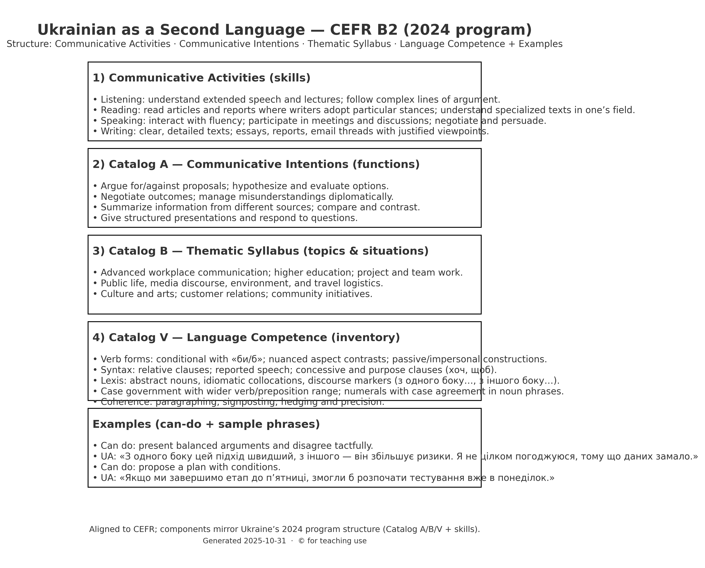
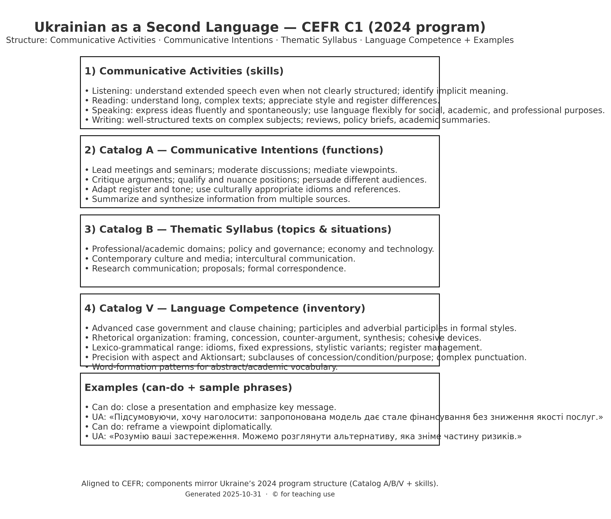
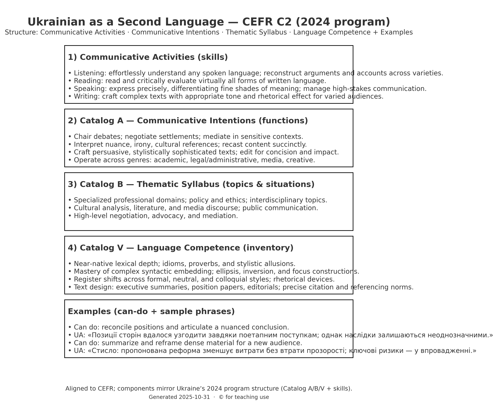

# Ukrainian as a Second Language — CEFR Program (2024)

> This Markdown reconstructs the content from the PDF so you can edit it in VS Code.

**Image assets:** Per‑level and A1 visuals are referenced below. Keep the PNGs in the same folder as this `.md` to see them in the VS Code preview.

## Table of contents

- [CEFR A1](#cefr-a1)
- [CEFR A2](#cefr-a2)
- [CEFR B1](#cefr-b1)
- [CEFR B2](#cefr-b2)
- [CEFR C1](#cefr-c1)
- [CEFR C2](#cefr-c2)
- [A1 Course Roadmap — Scope & Sequence](#a1-course-roadmap)
- [A1 Lesson Structure Template](#a1-lesson-structure-template)
- [Lesson 1 — Names & Greetings](#lesson-1—names--greetings)

---

## CEFR A1

### Communicative Activities (skills)
- Listening: recognize greetings, numbers, prices, simple directions; understand slow, clearly articulated speech.
- Reading: understand notices, labels, menus, timetables; fill in basic forms (name, nationality, phone).
- Speaking: introduce self and others; ask/answer very simple questions; order food/drink; buy a ticket.
- Writing: short messages and forms; simple sentences about personal details and daily routine.

### Catalog A — Communicative Intentions (functions)
- Greet, introduce, thank, apologize.
- Ask for/understand prices, quantities, time, and directions.
- Request repetition/clarification; spell a name; exchange contact details.
- Make simple purchases and bookings; use polite formulae.

### Catalog B — Thematic Syllabus (topics & situations)
- Personal data; family; home and city landmarks.
- Food and drink; cafés and shops; numbers, time & dates.
- Transport; weather; daily routine; basic services.

### Catalog V — Language Competence (inventory)
- Alphabet and sound–spelling; vowel length/stress; basic intonation patterns.
- Core high‑frequency vocabulary (survival phrases, café/shop, transport).
- Nouns: gender; singular nominative; basic plural; personal/possessive pronouns.
- Verbs: present tense of common verbs; imperative for requests; negation «не».
- Prepositions: у/в, на, до, з; yes/no questions (чи); basic SVO word order; numbers 1–20.

### Examples (can‑do + sample phrases)
- Can do: introduce self and ask a price.
- UA: «Добрий день! Мене звати Олена. Скільки коштує кава?»
- Can do: ask for directions.
- UA: «Пробачте, де метро? Мені прямо чи ліворуч?»

---

## CEFR A2

### Communicative Activities (skills)
- Listening: understand phrases and frequently used vocabulary related to immediate relevance (shopping, local geography, work).
- Reading: read short texts and personal letters; understand simple instructions and public information.
- Speaking: handle simple transactions; describe routine, plans, likes/dislikes; make arrangements.
- Writing: short emails/messages; notes about needs and appointments.

### Catalog A — Communicative Intentions (functions)
- Arrange meetings; invite/accept/decline; ask for help or information.
- Describe past activities and future plans in simple terms.
- Express preference, obligation and permission (можна, треба, хочу).
- Deal with services: post office, bank, clinic, housing.

### Catalog B — Thematic Syllabus (topics & situations)
- Housing and neighborhood; study/work basics.
- Health and appointments; travel and accommodation.
- Bank/post/telecom; weather and seasons; free time.

### Catalog V — Language Competence (inventory)
- Pronunciation: stress shift in inflection; common consonant clusters.
- Vocabulary: everyday collocations; phrasal formulae for services.
- Nouns/adjectives: plural; basic case use (Accusative for objects/motion to; Genitive for quantities/negation; Locative with у/в, на).
- Verbs: past and simple future; perfective vs. imperfective at phrase level; modal expressions (можна, треба, слід).
- Comparatives; time expressions; numerals to 100; question words (хто, що, де, коли, чому, як).

### Examples (can‑do + sample phrases)
- Can do: make a booking and ask for a bill.
- UA: «Я хочу забронювати кімнату на дві ночі. Можна рахунок, будь ласка?»
- Can do: describe yesterday and next week.
- UA: «Учора я був у бібліотеці, а наступного тижня поїду до Львова.»

---

## CEFR B1

### Communicative Activities (skills)
- Listening: understand main points of clear standard speech on work, study, and leisure.
- Reading: understand straightforward factual texts; follow news articles on familiar topics.
- Speaking: narrate experiences; explain reasons and opinions; deal with most situations while traveling.
- Writing: connected text on familiar topics; simple reports and complaint emails.

### Catalog A — Communicative Intentions (functions)
- Narrate the past; report events; talk about plans and goals.
- Give opinions, agree/disagree, and justify positions.
- Explain a problem and propose solutions; make formal requests.
- Handle unexpected situations (delays, errors, cancellations).

### Catalog B — Thematic Syllabus (topics & situations)
- Workplace and studies; media and technology use.
- Public services; health & emergencies; city life and transport.
- Leisure, culture, and local traditions; basic civic information.

### Catalog V — Language Competence (inventory)
- Cases: productive use of all cases in core patterns (Genitive after negation/quantities; Dative for addressee; Instrumental for means/agent).
- Verbs: aspect choice in narratives; present, past, future; imperatives; reflexive «‑ся».
- Complex sentences with що, коли, якщо, бо; reported requests; discourse markers (по‑перше, по‑друге, отже).
- Motion verbs with prefixes (йти/ходити; їхати/їздити + при‑, ви‑, за‑).
- Word‑formation: common prefixes/suffixes; collocations; numerals >100.

### Examples (can‑do + sample phrases)
- Can do: describe a move and give a reasoned opinion.
- UA: «Коли я переїхала до Києва, знайшла роботу в ІТ. Я вважаю, що віддалена робота ефективніша, бо дає більше гнучкості.»
- Can do: handle a complaint politely.
- UA: «На жаль, мій квиток не активувався. Чи могли б ви допомогти вирішити це питання?»

---

## CEFR B2

### Communicative Activities (skills)
- Listening: understand extended speech and lectures; follow complex lines of argument.
- Reading: read articles and reports where writers adopt particular stances; understand specialized texts in one’s field.
- Speaking: interact with fluency; participate in meetings and discussions; negotiate and persuade.
- Writing: clear, detailed texts; essays, reports, email threads with justified viewpoints.

### Catalog A — Communicative Intentions (functions)
- Argue for/against proposals; hypothesize and evaluate options.
- Negotiate outcomes; manage misunderstandings diplomatically.
- Summarize information from different sources; compare and contrast.
- Give structured presentations and respond to questions.

### Catalog B — Thematic Syllabus (topics & situations)
- Advanced workplace communication; higher education; project and team work.
- Public life, media discourse, environment, and travel logistics.
- Culture and arts; customer relations; community initiatives.

### Catalog V — Language Competence (inventory)
- Verb forms: conditional with «би/б»; nuanced aspect contrasts; passive/impersonal constructions.
- Syntax: relative clauses; reported speech; concessive and purpose clauses (хоч, щоб).
- Lexis: abstract nouns, idiomatic collocations, discourse markers (з одного боку…, з іншого боку…).
- Case government with wider verb/preposition range; numerals with case agreement in noun phrases.
- Coherence: paragraphing, signposting; hedging and precision.

### Examples (can‑do + sample phrases)
- Can do: present balanced arguments and disagree tactfully.
- UA: «З одного боку цей підхід швидший, з іншого — він збільшує ризики. Я не цілком погоджуюся, тому що даних замало.»
- Can do: propose a plan with conditions.
- UA: «Якщо ми завершимо етап до п’ятниці, змогли б розпочати тестування вже в понеділок.»

---

## CEFR C1

### Communicative Activities (skills)
- Listening: understand extended speech even when not clearly structured; identify implicit meaning.
- Reading: understand long, complex texts; appreciate style and register differences.
- Speaking: express ideas fluently and spontaneously; use language flexibly for social, academic, and professional purposes.
- Writing: well‑structured texts on complex subjects; reviews, policy briefs, academic summaries.

### Catalog A — Communicative Intentions (functions)
- Lead meetings and seminars; moderate discussions; mediate viewpoints.
- Critique arguments; qualify and nuance positions; persuade different audiences.
- Adapt register and tone; use culturally appropriate idioms and references.
- Summarize and synthesize information from multiple sources.

### Catalog B — Thematic Syllabus (topics & situations)
- Professional/academic domains; policy and governance; economy and technology.
- Contemporary culture and media; intercultural communication.
- Research communication; proposals; formal correspondence.

### Catalog V — Language Competence (inventory)
- Advanced case government and clause chaining; participles and adverbial participles in formal styles.
- Rhetorical organization: framing, concession, counter‑argument, synthesis; cohesive devices.
- Lexico‑grammatical range: idioms, fixed expressions, stylistic variants; register management.
- Precision with aspect and Aktionsart; subclauses of concession/condition/purpose; complex punctuation.
- Word‑formation patterns for abstract/academic vocabulary.

### Examples (can‑do + sample phrases)
- Can do: close a presentation and emphasize key message.
- UA: «Підсумовуючи, хочу наголосити: запропонована модель дає стале фінансування без зниження якості послуг.»
- Can do: reframe a viewpoint diplomatically.
- UA: «Розумію ваші застереження. Можемо розглянути альтернативу, яка зніме частину ризиків.»

---

## CEFR C2

### Communicative Activities (skills)
- Listening: effortlessly understand any spoken language; reconstruct arguments and accounts across varieties.
- Reading: read and critically evaluate virtually all forms of written language.
- Speaking: express precisely, differentiating fine shades of meaning; manage high‑stakes communication.
- Writing: craft complex texts with appropriate tone and rhetorical effect for varied audiences.

### Catalog A — Communicative Intentions (functions)
- Chair debates; negotiate settlements; mediate in sensitive contexts.
- Interpret nuance, irony, cultural references; recast content succinctly.
- Craft persuasive, stylistically sophisticated texts; edit for concision and impact.
- Operate across genres: academic, legal/administrative, media, creative.

### Catalog B — Thematic Syllabus (topics & situations)
- Specialized professional domains; policy and ethics; interdisciplinary topics.
- Cultural analysis, literature, and media discourse; public communication.
- High‑level negotiation, advocacy, and mediation.

### Catalog V — Language Competence (inventory)
- Near‑native lexical depth; idioms, proverbs, and stylistic allusions.
- Mastery of complex syntactic embedding; ellipsis, inversion, and focus constructions.
- Register shifts across formal, neutral, and colloquial styles; rhetorical devices.
- Text design: executive summaries, position papers, editorials; precise citation and referencing norms.

### Examples (can‑do + sample phrases)
- Can do: reconcile positions and articulate a nuanced conclusion.
- UA: «Позиції сторін вдалося узгодити завдяки поетапним поступкам; однак наслідки залишаються неоднозначними.»
- Can do: summarize and reframe dense material for a new audience.
- UA: «Стисло: пропонована реформа зменшує витрати без втрати прозорості; ключові ризики — у впровадженні.»

---

## A1 Course Roadmap — Scope & Sequence

| Unit | Communicative intentions | Language inventory highlights | Real‑life tasks |
|---|---|---|---|
| 0. Orientation & Classroom Language | Greet; ask for classroom help; repeat/spell; basic politeness. | Alphabet subset; key sounds; classroom phrases; yes/no «так/ні»; «будь ласка/дякую». | Set up Cyrillic keyboard; name card; alphabet bingo. |
| 1. Meet & Greet | Introduce self/others; ask and give names, country; exchange pleasantries. | Chunks «Мене звати…», «Як вас/тебе звати?»; pronouns я, ти/ви; negation «не». | Mingle introductions; ‘find someone from…’ survey. |
| 2. Contacts | Share phone/email; ask to repeat/spell; give nationality/language. | Numbers 0–20; «мій/моя/моє»; letters & email symbols; question words хто/що/де. | Fill a form; exchange contacts; voicemail practice. |
| 3. Time & Routine (lite) | Say today/tomorrow; state simple daily actions. | Present tense of high‑frequency verbs (жити, працювати, вчитися); adverbs часто/рідко. | My day in 5 sentences; class schedule phrases. |
| 4. Shopping & Prices | Ask price/quantity; buy basic items. | «Скільки коштує…?»; numerals 1–20; measure words (кілограм, літр); «карткою/готівкою». | Market role‑play with price list; receipts. |
| 5. Café | Order food/drink; request the bill; specify preferences. | Polite requests «…будь ласка»; «Мені…», «без/з»; imperative for service verbs. | Menu reading; café role‑play; tip & bill. |
| 6. Directions & City | Ask and understand simple directions; locate places. | Prepositions у/в, на; adverbs прямо, ліворуч, праворуч, близько/далеко. | Map walk; ‘find the metro’ info‑gap. |
| 7. Transport & Tickets | Buy tickets; ask where/when; state destination. | «Куди?», «Коли?»; chunks «квиток до…», «о десятій» (to the hour). | Station role‑play; simple timetable reading. |
| 8. Home & Accommodation | Describe home/room; ask about amenities. | There is/there are «є»; basic adjectives (маленький/великий, новий/старий). | Rental ad info‑gap; describe your room. |
| 9. Appointments & Services | Make/confirm an appointment; ask for service. | «Можна…?» «Мені треба…»; days of week; time to the hour. | Clinic/hairdresser booking dialogs; calendar task. |
| 10. Health Essentials | Describe simple symptoms; ask for pharmacy help. | Chunks: «болить голова/живіт», «таблетки», «аптека». | Pharmacy role‑play with symptom cards. |
| 11. Wrap‑up & Survival | Combine skills in real‑life scenarios. | Review; expansion to 0–100 (optional); set phrases for travel. | Final project: ‘48 hours in Kyiv/Lviv’ survival tasks. |

---

## A1 Lesson Structure Template

### 90‑minute flow
- **0–5 min** — Welcome & goals: quick check‑in, display lesson targets and can‑dos.
- **5–15 min** — Sound focus & phrase bank: short pronunciation drill tied to the target dialog.
- **15–30 min** — Comprehensible input: model dialog + meaning check (gestures, visuals).
- **30–45 min** — Controlled practice: substitution drills, pair Q/A, cue cards.
- **45–70 min** — Communicative task: role‑play or info‑gap with a clear real‑life goal.
- **70–80 min** — Micro‑assessment: 3–4 prompts aligned to can‑dos (oral + quick written).
- **80–90 min** — Feedback & homework briefing; exit ticket.

### 60‑minute flow
- **0–5 min** — Welcome & goals.
- **5–12 min** — Sound focus & phrase bank.
- **12–25 min** — Model dialog + meaning check.
- **25–40 min** — Controlled practice.
- **40–52 min** — Communicative task.
- **52–60 min** — Micro‑assessment + homework.

### Micro‑assessment toolkit
- Performance checklist mapped to can‑dos (✓/partial/needs work).
- Mini dictation or fill‑in (2–3 items) for key phrases.
- Pronunciation spot check (names, numbers, stress).

### Homework menu
- Audio repeat‑along for phrase bank (alphabet + greetings).
- My card: name, country, phone/email (fillable).
- Short mingle video task: introduce yourself to a classmate/friend (30–45s).

---

## Lesson 1 — Names & Greetings

### Goals
- Students can greet formally/informally and say goodbye.
- Students can ask and say names; optionally say country.
- Students can spell their name using Ukrainian letters (subset).

### Can‑do statements
- Say: «Привіт/Добрий день/До побачення».
- Ask/Give name: «Як вас/тебе звати?» — «Мене звати…».
- Say country with «Я з …» using a few country names as chunks.
- Ask for repetition: «Повторіть, будь ласка».
- Numbers 0–10 for phone/email fragments (optional).

### Language inventory (Lesson 1)
- Pronunciation: А, О, У, І, М, Н, К, Т, Р; stress basics; polite intonation.
- Phrases: «Мене звати…», «Як вас/тебе звати?», «Дуже приємно», «Будь ласка», «Дякую».
- Pronouns: я, ви/ти; negation «не» (as a chunk: «Я не …»).
- Question particle «чи» for yes/no questions (recognition).
- Alphabet + email symbols (@ «ет»).

### Procedure (90 minutes)
- **0–5**: Warm‑up: teacher greets with «Привіт/Добрий день». Students repeat; quick class greeting circle.
- **5–12**: Sound focus: A‑O‑U‑I and M‑N‑K‑T‑R. Choral → individual.
- **12–20**: Model dialog (T↔S): — «Добрий день! Як вас звати?» — «Мене звати Анна. А вас?» — «Іван. Дуже приємно» — «Взаємно».
- **20–30**: Meaning check (gestures/cards); build phrase bank on board.
- **30–42**: Controlled pairs: substitution with name cards; add «Я з …».
- **42–55**: Mingle: meet 5 classmates and record names/countries.
- **55–65**: Pronunciation spot check: students spell their name (subset letters).
- **65–80**: Role‑play at info desk: learn and write name; optional numbers 0–10.
- **80–90**: Micro‑assessment: each student says two sentences: «Мене звати… Я з …». Exit ticket form.

### Materials
- Name cards, alphabet handout, mini‑menu of greetings, country cards (5–7).
- Audio or teacher model of dialog; projector/board; timer.

### Homework
- Record a 20–30s self‑intro using the phrase bank.
- Alphabet practice sheet: circle letters you hear; write your name.
- Mini‑vocab: greetings (6 items) — spaced‑repetition set.
